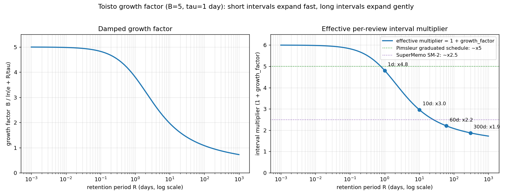

# Software documentation

## Concepts and labels

Built-in concepts are located in `src/concepts` in the form of JSON files. See the documentation on the [concept file format](./concept_files.md) for more information.

## Quizzes

Toisto uses the concepts to generate quizzes. Currently, the following types of quizzes are generated:

Translation quizzes:

1. Translate a concept from the target language to the source language.
2. Listen to a concept in the target language and then type in what was said.
3. Translate a concept from the source language to the target language.
4. Listen to a concept in the target language and then translate what was said in the source language.

Grammatical quizzes:

5. Singularize a plural concept or pluralize a singular concept.
6. Diminutize a concept.
7. Change the person of a concept.
8. Change the gender of a concept.
9. Provide the positive, comparative, or superlative degree of comparison, given an adjective in another degree.
10. Change the tense of a concept between infinitive, present tense, and past tense.
11. Change the aspect of a concept from perfective to imperfective and vice versa.
12. Change the grammatical mood of a concept between declarative, interrogative, and imperative mood.
13. Change the polarity from affirmative to negative and vice versa.
14. Change cardinal numbers into ordinal numbers and vice versa.
15. Change the grammatical case of a noun (nominative ↔ partitive).
16. Fill in the missing inflected word in a sentence (cloze test).

Semantic quizzes:

17. Give the antonym.
18. Answer a question.
19. Abbreviate a concept or give the full-form of the abbreviation.
20. Put the words of a shuffled sentence in the right order.

Except when asking the user to translate from the source language to the target language, quizzes only use the user's target language.

## Extending grammatical categories

To add a new grammatical case (e.g., `"genitive"`) or another value of an existing grammatical category, edit:

1. **`src/toisto/model/language/grammatical_category.py`** — add the value to the relevant `Literal` type (e.g., `GrammaticalCase`). If the value is meaning-changing across languages — i.e., it should *not* be accepted as a translation of the unmarked form in another language — also add it to `SEMANTIC_NON_DEFAULT_CATEGORIES`. The default value of a category (e.g., `"nominative"` for case) belongs in `DEFAULT_CATEGORIES` instead.

2. **`src/toisto/model/quiz/quiz_type.py`** — define a `GrammaticalQuizType` instance for the value (e.g., `GENITIVE = GrammaticalQuizType("genitive")`) and append it to `GRAMMATICAL_QUIZ_TYPES`.

3. **`docs/concept_files.md`** — list the new value in the relevant section so concept authors know they can use it.

Concept JSON files can then use the value as a nested key in label objects; the label factory and quiz generator handle it without further changes.

## Spaced repetition

Toisto uses a very simple implementation of a spaced repetition algorithm. Toisto does not make assumptions about how many concepts the user wants to practice per session or per day. It only keeps track of the retention of quizzes, i.e. how long the user has been correctly answering a quiz. Retention is defined as the time between the most recent correct answer and the oldest correct answer, where there have been no incorrect answers in between.

For example, if a user answers a quiz correctly on March 1, incorrectly on March 3, correctly on March 6, correctly on March 8, and correctly on March 15, that quiz has a retention of nine days (March 6 to March 15).

Each time a quiz is answered correctly, the quiz is "silenced" (not presented again) for a while. The longer the quiz's current retention, the longer the quiz is silenced. Whenever the user makes a mistake the retention is reset to zero. If a user knows the correct answer the first time a quiz is presented, the quiz is silenced for 24 hours.

### Growth factor

For subsequent correct answers the silence interval is a multiple of the current retention period: `skip_until = now + retention_period * growth_factor`. So the longer the user has already retained the answer, the longer the quiz is silenced next.

Rather than a constant growth factor, Toisto dampens the factor as the retention period grows. With a constant factor `f`, the retention period would compound by `(1 + f)` on every review (when reviewing exactly when due), so even a moderate `f` would push a quiz answered correctly a handful of times to intervals of months and then years — far beyond the user's actual forgetting curve. Instead the factor shrinks as the retention period `R` grows:

```text
                   B
growth_factor(R) = ------------- ,  ratio = R / tau
                   ln(e + ratio)
```

Here `B` (`SKIP_INTERVAL_MAX_GROWTH_FACTOR`, currently 5) is the factor approached for very short retention periods, and `tau` (`SKIP_INTERVAL_DAMPING_TIMESCALE`, currently one day) is the retention period scale at which damping becomes noticeable. The `e +` inside the logarithm is the key trick: when `R` is small the denominator is `ln(e + 0) = 1`, so short intervals get (almost) the full factor `B` — which keeps a just-failed quiz from being repeated more often within a single session. As `R` grows the denominator grows like `ln(R)`, so the factor decays slowly: the interval keeps growing on every review (it never flattens or shrinks), but the per-review multiplier eases off instead of compounding at a fixed rate. The `e +` also keeps the denominator above 1 for every positive `R` (avoiding the negative or undefined values of `ln` below 1), so the factor is always positive and never exceeds `B`.

With `B = 5` and `tau = 1 day` the effective per-review multiplier `1 + growth_factor` works out to roughly ×6 for sub-day intervals, ×4.8 at 1 day, ×3 at 10 days, ×2.2 at 60 days, and ×1.9 at 300 days — largest for the shortest intervals, easing to modest single-digit multipliers for the multi-day-to-multi-month intervals that matter most for long-term retention. This spans the per-review factors of established schedules — SuperMemo's SM-2 settles to about ×2.5 and Pimsleur's graduated schedule to about ×5 — while vocabulary experiments find the exact factor is not critical as long as items are spaced.



The graph is generated by [`plot_growth_factor.py`](plot_growth_factor.py); regenerate it with `uv run --no-project --script docs/plot_growth_factor.py`.

### Literature

The algorithm is informed by the following sources on spaced repetition for vocabulary/language learning and by algorithmic spacing schedules (all open access):

- Pimsleur, P. (1967). [A memory schedule](https://files.eric.ed.gov/fulltext/ED012150.pdf) — graduated-interval recall for vocabulary; per-step factor ≈5.
- Bahrick, H. P., et al. (1993). [Maintenance of foreign language vocabulary and the spacing effect](https://gwern.net/doc/psychology/spaced-repetition/1993-bahrick.pdf) — longer spacing gives substantially better long-term retention.
- Woźniak, P. A., & Gorzelańczyk, E. J. (1994). [Optimization of repetition spacing in the practice of learning](https://ane.pl/index.php/ane/article/download/1003/1003) — SuperMemo SM-2; per-review factor ≈2.5.
- Pavlik, P. I., & Anderson, J. R. (2005). [Practice and forgetting effects on vocabulary memory: an activation-based model of the spacing effect](http://act-r.psy.cmu.edu/wordpress/wp-content/uploads/2012/12/409s15516709cog0000_14.pdf).
- Karpicke, J. D., & Bauernschmidt, A. (2011). [Spaced retrieval: absolute spacing enhances learning regardless of relative spacing](https://learninglab.psych.purdue.edu/downloads/2011/2011_Karpicke_Bauernschmidt_JEPLMC.pdf) — the relative schedule barely matters; absolute spacing does.
- Kang, S. H. K., et al. (2014). [Retrieval practice over the long term: should spacing be expanding or equal-interval?](https://laplab.ucsd.edu/articles/In%20press%20version/Kang_etal_PBR2014.pdf)
- Settles, B., & Meeder, B. (2016). [A trainable spaced repetition model for language learning](https://aclanthology.org/P16-1174.pdf).

## Progress savefile

When the program is stopped, progress is saved in a file named `.toisto-{device specific id}-progress-{target language}.json` in the user's home folder, for example `.toisto-c5323926-33e2-1eef-a453-2922a2aed6c5-progress-fi.json`. So each target language gets its own progress file.

Each entry in the file is the progress of one specific quiz. The key denotes the quiz, the value contains information about the user's retention of the quiz. This looks as follows:

```json
{
    "nl:fi:lezen:lukea:translate": {
        "count": 2
    },
    "nl:fi:het oog:silmä:translate": {
        "start": "2023-02-25T17:34:37",
        "end": "2023-02-25T17:35:37",
        "skip_until": "2023-02-26T17:40:37",
        "count": 3
    }
}
```

The key format was changed in Toisto v0.28 to not include the concept identifier. This allows for changing the concept identifier without invalidating the user's progress on quizzes for that concept. Whenever Toisto reads a progress file with keys in the old format, it converts the keys the new format, where possible (it can only do so for concepts the user wants to practice). The old format looks as follows:

```json
{
    "to read:nl:fi:lezen:translate": {
        "count": 2
    },
    "eye:nl:fi:het oog:translate": {
        "start": "2023-02-25T17:34:37",
        "end": "2023-02-25T17:35:37",
        "skip_until": "2023-02-26T17:40:37",
        "count": 3
    }
}
```

The first entry is the quiz to translate "lezen" from Dutch to Finnish. This quiz has been presented to the user twice (`count` is 2), but they haven't answered it correctly since the last time it was presented.

The second entry is the quiz to translate "het oog" from Dutch to Finnish. This quiz has been presented to the user three times (`count` is 3) in the period between `start` and `end` and they have answered it correctly each time. Toisto will not present to quiz again until after `skip_until`.

The keys in the savefile contain the question label of quizzes. That means that when the label of a concept changes, for example to fix spelling, progress on quizzes that use the label will be lost.
